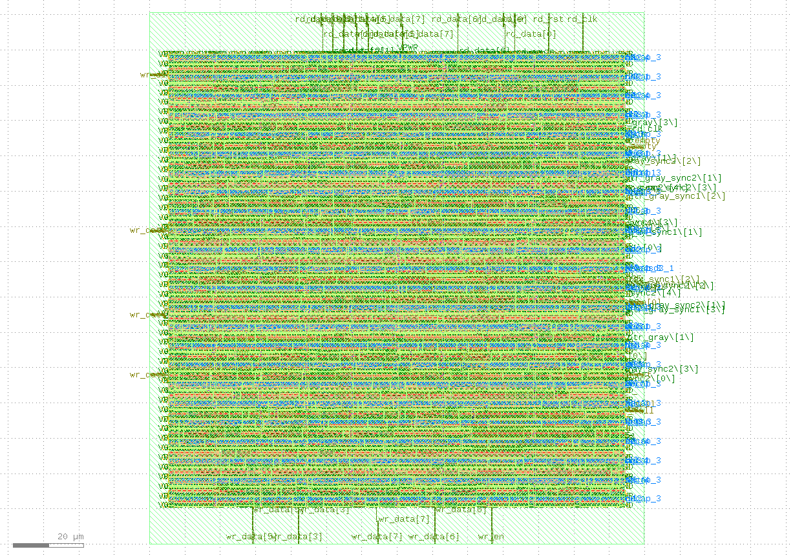

## ⚙️ Flow Steps
1. RTL design (`async_fifo.v`)  
2. Testbench simulation (`async_fifo_tb.v`)  
3. Synthesis with Yosys  
4. Floorplanning, Placement, CTS, Routing with OpenLane  
5. DRC/LVS checks and GDSII generation  

## 🖥️ Simulation
To run the testbench:
```bash
iverilog -o async_fifo_tb async_fifo.v async_fifo_tb.v
vvp async_fifo_tb
gtkwave async_fifo_tb.vcd
```


### Run RTL-to-GDSII Flow with OpenLane

Use the following command to launch the OpenLane Docker container and run the flow:

```bash
cd /home/USER/OpenLane && \
docker run --rm \
  -v /home/USER:/home/USER \
  -v /home/USER/OpenLane:/openlane \
  -v /home/USER/.volare:/home/USER/.volare \
  -e PDK_ROOT=/home/USER/.volare \
  -e PDK=sky130A \
  --user $(id -u):$(id -g) \
  efabless/openlane:e73fb3c57e687a0023fcd4dcfd1566ecd478362a-amd64 \
  sh -c "./flow.tcl -design async_fifo -overwrite"
```



The src folder contains the RTL source file async_fifo.v and its associated timing constraints file async_fifo.sdc. These files serve as the primary input for the OpenLane RTL-to-GDS flow, defining the asynchronous FIFO design and its timing requirements. Any updates to the FIFO design or its constraints should be made within this folder to ensure they are correctly used during synthesis, placement, and routing.

The config.json defines the design parameters and flow settings for OpenLane, including RTL sources, clock constraints, and floorplan utilization.
It also specifies power distribution network (PDN) settings, guiding automated PnR and signoff steps for the async_fifo design.


### Placement Stage

In the placement stage of the OpenLane RTL-to-GDSII flow, the synthesized netlist is mapped onto the chip floorplan. Standard cells are positioned while meeting congestion, timing, and power requirements. The main files generated include:  
- **async_fifo.nl**: gate-level netlist from synthesis, used as input to placement.  
- **async_fifo.pnl**: post-placement netlist updated with optimizations such as buffering or resizing.  
- **async_fifo.def**: DEF file containing physical layout details like placed cells and macros.  
- **async_fifo.odb**: OpenROAD’s internal database snapshot storing the complete design state.  

These outputs form the foundation for clock tree synthesis (CTS) and routing in later stages of the flow.

