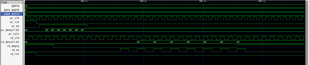

## ⚙️ Flow Steps
1. RTL design (`async_fifo.v`)  
2. Testbench simulation (`async_fifo_tb.v`)  
3. Synthesis with Yosys  
4. Floorplanning, Placement, CTS, Routing with OpenLane  
5. DRC/LVS checks and GDSII generation  

## 🖥️ Simulation
To run the testbench:
```bash
iverilog -o async_fifo_tb async_fifo.v async_fifo_tb.v
vvp async_fifo_tb
gtkwave async_fifo_tb.vcd


